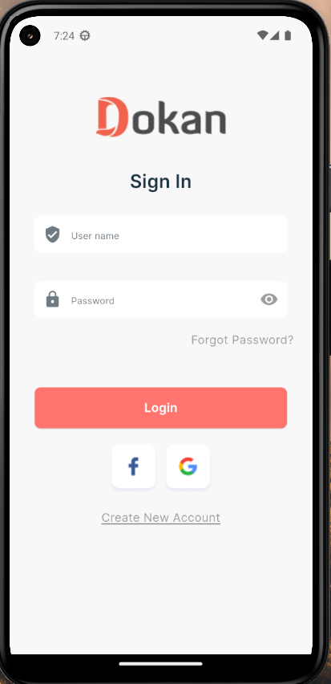
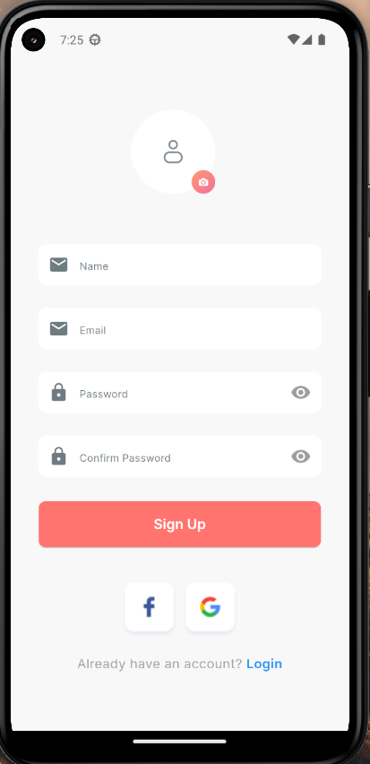
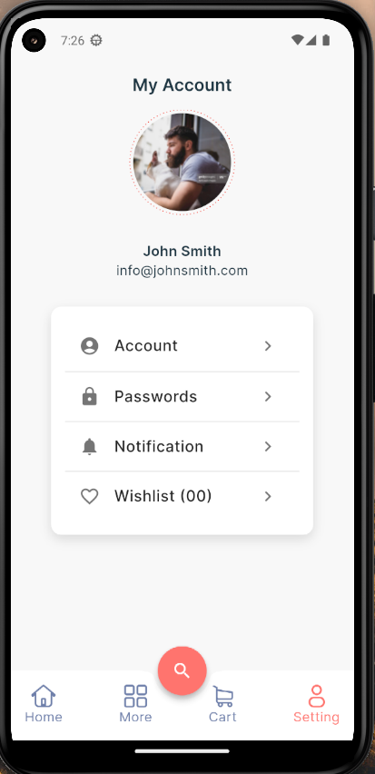
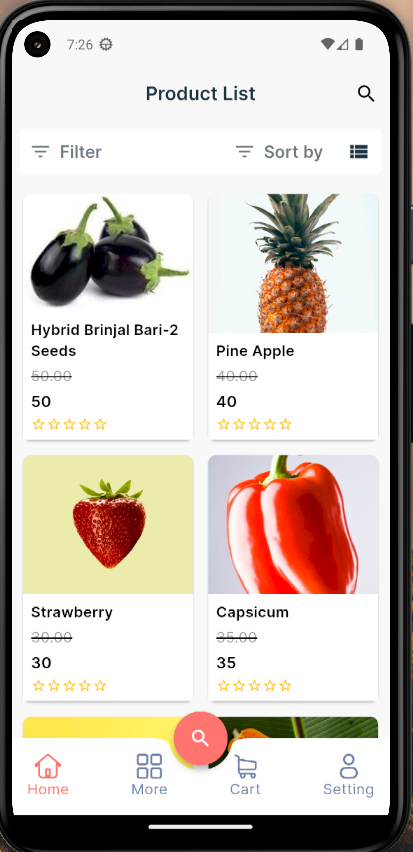
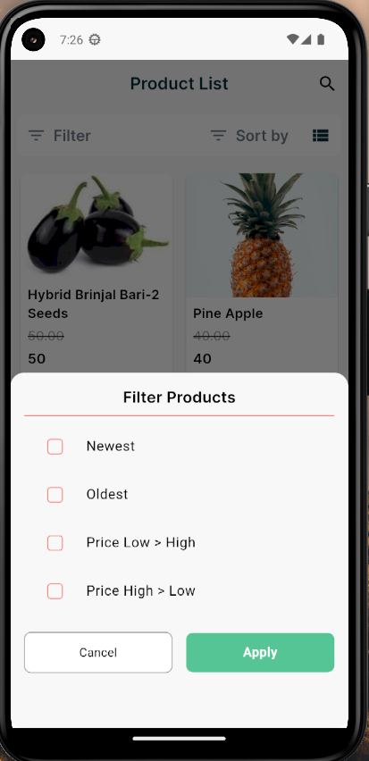
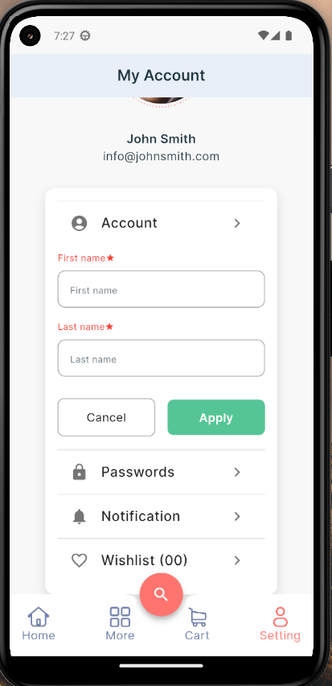

<h1>Flutter Assessment Project with MVVM</h1>

Welcome to the Flutter Assessment project! This project follows a structured architecture inspired by MVVM (Model-View-ViewModel) principles to enhance maintainability and scalability. It is organized into different directories, each serving a specific purpose.

<h2>Project Structure</h2>

<pre>
lib
|-- app
|   |-- core
|   |   |-- base
|   |   |-- provider
|   |   |-- route
|   |   |-- service
|   |   |-- values
|   |-- data
|   |   |-- local
|   |   |-- remote
|   |   |-- repository
|   |-- modules
|   |   |-- home
|   |   |   |-- view
|   |   |   |-- controller
|   |   |-- details
|   |   |   |-- view
|   |   |   |-- controller
|   |-- network
|   |   |-- exception
|   |   |-- client
|   |-- utils
|-- flavors
|-- main_dev.dart
|-- main_prod.dart
</pre>

<h3>Directory Structure</h3>

<ul>
  <li><strong>core:</strong> Core functionality including base classes, providers, routes, services, and constant values.</li>
  <li><strong>data:</strong> Data layer containing local (database) and remote (API) data sources and repositories.</li>
  <li><strong>modules:</strong> Feature-based organization, each module represents a feature in the app (e.g., home, settings,login,signup).</li>
  <li><strong>network:</strong> Network-related classes, including exceptions and HTTP client.</li>
  <li><strong>utils:</strong> Utility functions and helpers.</li>
</ul>

<h3>Feature Images</h3>

  

    
  

  

    
  

    

    
  

  

    
  

  

    
  

    

    
  

<h3>Flavors</h3>

<ul>
  <li><strong>flavors:</strong> Configuration files for different app flavors like dev & prod.</li>
</ul>

<h3>Entry Points</h3>

<ul>
  <li><strong>main_dev.dart:</strong> Entry point for the development environment.</li>
  <li><strong>main_prod.dart:</strong> Entry point for the production environment.</li>
</ul>

<h2>Getting Started</h2>

<ol>
  <li>Clone the repository:</li>

  <pre><code>git clone https://gitlab.com/shakircam/flutter_assignment.git
cd YourRepositoryName</code></pre>

  <li>Switch to the appropriate branch (e.g., <code>master</code>):</li>

  <pre><code>git checkout master</code></pre>

  <li>Install dependencies:</li>

  <pre><code>flutter pub get</code></pre>

  <li>Run the app:</li>

  <pre><code>flutter run --flavor dev lib/main_dev.dart --release</code></pre>
  <pre><code>flutter run --flavor prod lib/main_prod.dart --release</code></pre>
</ol>

<h2>Features</h2>

<ul>
  <li><strong>Wordpress API Integration:</strong> Login, Signup, User update.</li>
  <li><strong>Home page products:</strong> Import json response to asset folder and show list of products.</li>
  <li><strong>Local Database (FlutterSecureStorage):</strong> Save the small data locally using FlutterSecureStorage.</li>
  <li><strong>Provider for State Management:</strong> Utilize the Provider package for state management.</li>
  <li><strong>Service locator:</strong> Decouple the interface(abstract base class) from a concreate implementation.</li>
</ul>

Feel free to explore each module for specific implementations and customization.

Reference project link <a href="https://github.com/hasancse91/flutter_getx_template">https://github.com/hasancse91/flutter_getx_template</a>.

<h2>Contribution</h2>

Contributions are welcome! Before contributing, please read the <a href="CONTRIBUTING.md">contribution guidelines</a>.

<h2>License</h2>

This project is licensed under the <a href="LICENSE">MIT License</a>.

